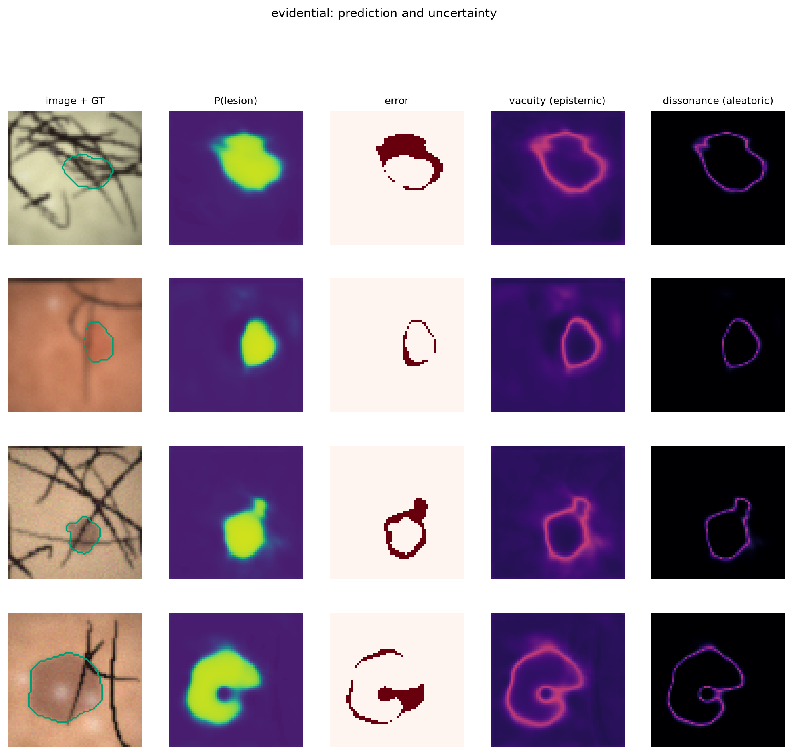
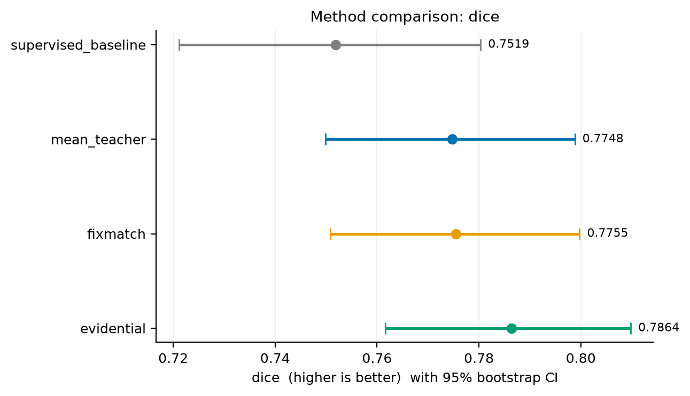
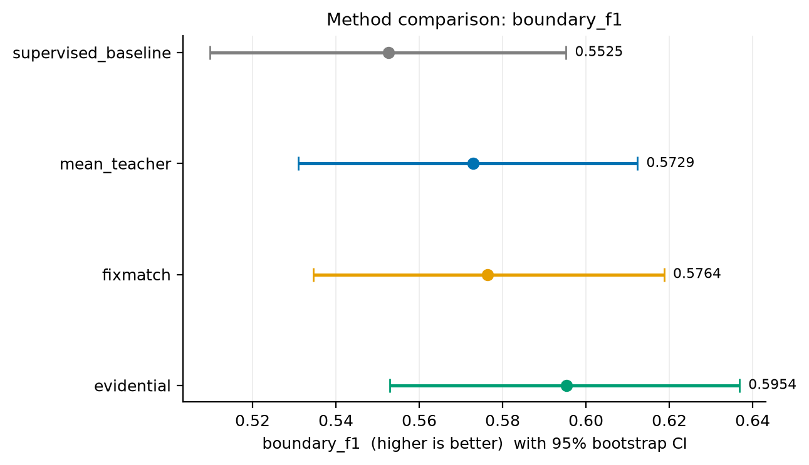
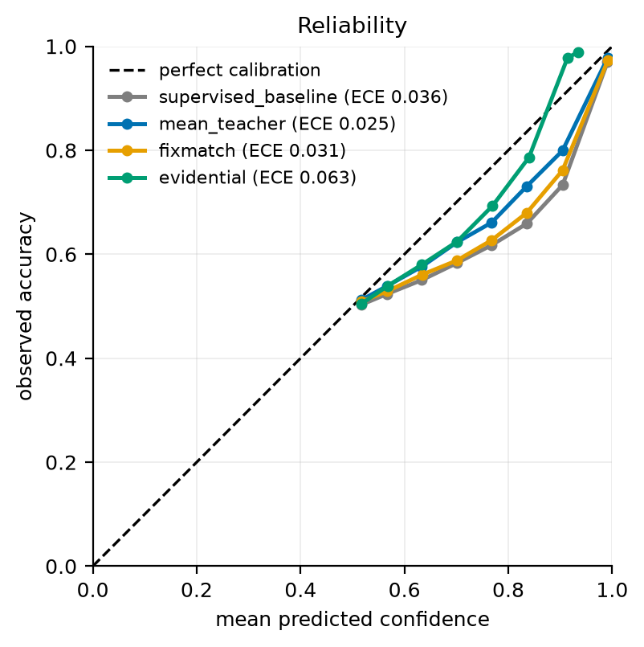
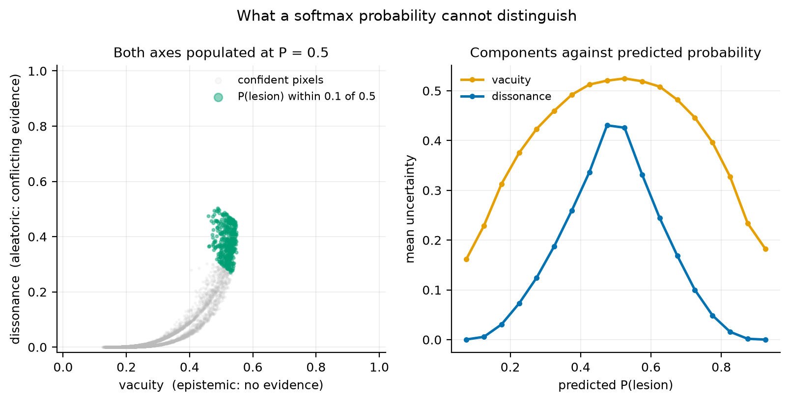
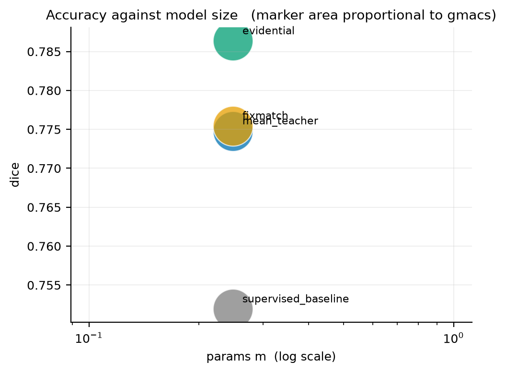

# Calibrated Uncertainty over Confidence Thresholds

<!-- links:begin -->
**[Live results and figures](https://evissl-arslan.surge.sh)** &nbsp;·&nbsp; **[Source](https://github.com/arslan-ahm/evidential-semi-supervised-lesion-segmentation)** &nbsp;·&nbsp; [All seven projects](https://seven-ai-projects-arslan.surge.sh)
<!-- links:end -->

> **Evidential semi-supervised skin lesion segmentation in a sub-1M-parameter
> network — and a seed study that retracts its own headline result.**

Semi-supervised segmentation has to decide *which unlabelled pixels the student
should learn from*. Almost every method decides with a confidence threshold:
keep the pixel if `max_k p_k > 0.95`. This repository argues the threshold asks
the wrong question, replaces it with a subjective-logic decomposition of an
evidential head, and then measures the difference honestly enough to withdraw
its own claim.

---

## Summary for the reader in a hurry

|  | Finding | Status |
|---|---|---|
| ⚡ | **32× fewer parameters, 5.87× lower latency** than the reference U-Net (0.96 M vs 31.0 M) | **Measured** |
| ⚖️ | **125× smaller costs nothing measurable** in accuracy (+0.0142 Dice, CI spans zero) | **Measured** |
| 🔬 | Vacuity/dissonance **provably separate** two states a softmax reports identically | **Arithmetic** |
| ❌ | The **boundary-F1 gain this project was built around** is half the run-to-run noise | **Retracted** |
| ⚠️ | The one robust statistical result is **negative**: our calibration is ~16× worse than Mean Teacher | **Robust** |

**Contents** ·
[Problem](#1-the-problem-a-threshold-cannot-see) ·
[Method](#2-method-vacuity-gates-dissonance-tempers) ·
[Results](#3-results) ·
[Retraction](#4-the-seed-study-that-retracts-the-headline) ·
[Efficiency](#5-efficiency-measured-not-quoted) ·
[Reproduce](#6-reproduce) ·
[Citation](#8-citation)

---

## 1. The problem: a threshold cannot see

Take two pixels the network scores at `P(lesion) = 0.5`.

- The **first** sits in a region unlike anything in the labelled set. `0.5` means
  *"I have no idea."*
- The **second** sits on the boundary of a low-contrast lesion, where the
  transition genuinely spans several pixels. `0.5` is the **correct answer**.

A softmax reports these identically, so a threshold discards both — and the
second was real information about where the boundary lies. This matters more
than it sounds: Dice is dominated by the easy lesion interior, while the errors
that count live in a few-pixel band around the contour.

> **A threshold-based method is structurally blind to its hardest examples.**

An evidential head separates the two cases. This is asserted numerically, not
claimed:

| case | logits | `P(lesion)` | vacuity (epistemic) | dissonance (aleatoric) |
|---|---|---|---|---|
| no evidence | `[-60, -60]` | 0.500 | **1.000** | 0.000 |
| conflicting evidence | `[+30, +30]` | 0.500 | 0.032 | **0.968** |
| confident lesion | `[-30, +30]` | 0.969 | 0.062 | 0.000 |

Same probability, opposite epistemic state.
→ `tests/test_uncertainty.py::test_conflicting_evidence_is_dissonance_not_vacuity`

<p align="center">
  
  <br><sub><b>Figure 1.</b> Predictions against ground truth. The interesting errors are all on the contour, not in the interior.</sub>
</p>

---

## 2. Method: vacuity gates, dissonance tempers

The two uncertainty types call for two different actions, and that split is the
contribution.

**Vacuity gates the weight.** Each unlabelled pixel enters the consistency loss
weighted by `1 - u`, the teacher's total belief mass — literally how much
evidence it has accumulated there. Continuous, bounded, no threshold to tune.

**Dissonance tempers the target.** The sharpening temperature is set per pixel
as `T_eff = T + (1 - T) · diss`, so a decided pixel is sharpened fully and a
genuinely ambiguous one is left alone. Sharpening an ambiguous boundary pixel
manufactures a confident label the image does not support, and the student then
learns that fabrication. Costs no extra hyper-parameter.

| method | per-pixel weight | target |
|---|---|---|
| Mean Teacher | `1` | teacher probability |
| FixMatch | `1[max_k p_k > τ]` | one-hot `argmax` |
| **ours** | `1 - u` (vacuity) | dissonance-tempered sharpen |

> [!WARNING]
> **Only the first half survives measurement.** The vacuity gate produces the
> largest-effect improvement. Dissonance tempering is **dormant** in the trained
> model — mean dissonance is 0.018 — so this repository does not claim it
> contributes. See [§4](#4-the-seed-study-that-retracts-the-headline).

Full derivation, including why binary dissonance collapses to `2·min(b₀, b₁)`:
**[docs/METHOD.md](docs/METHOD.md)**

<details>
<summary><b>Why the mechanism differs from FixMatch, measured per epoch</b></summary>

<br>

`train_mask_rate` — the fraction of unlabelled pixels actually contributing to
the loss, logged per epoch from `results/runs/*/history.jsonl`:

| method | epoch 0 | 1 | 2 | 3 | 4 | 5 | … | 19 |
|---|---|---|---|---|---|---|---|---|
| Mean Teacher | 0.970 | 0.972 | 0.970 | 0.972 | 0.976 | 0.967 | … | 0.974 |
| FixMatch | **0.000** | **0.000** | **0.004** | 0.309 | 0.637 | 0.747 | … | 0.825 |
| ours | 0.397 | 0.402 | 0.425 | 0.478 | 0.543 | 0.594 | … | 0.774 |

**FixMatch's consistency branch contributes literally nothing for three epochs** —
its threshold is never met, so it *is* the supervised baseline during the period
when the unlabelled pool would be most useful. Mean Teacher uses ~97% of pixels
from epoch 0, including those where the teacher has no evidence at all. The
vacuity gate starts at 40% and rises with the evidence the teacher accumulates.

These are logged quantities, not estimates.

</details>

---

## 3. Results

Four methods, one training loop, 600 images with **60 labelled (10%)**, 150 test
images. `semi.method` is the only thing that differs between them.

| run | Dice ↑ | IoU ↑ | HD95 ↓ | BF1 ↑ | ECE ↓ | MCE ↓ |
|---|---|---|---|---|---|---|
| supervised_baseline | 0.7519 | 0.6340 | 7.610 | 0.5525 | 0.0361 | 0.1766 |
| mean_teacher | 0.7748 | 0.6568 | 6.839 | 0.5729 | **0.0246** | 0.1070 |
| fixmatch | 0.7755 | 0.6575 | **6.702** | 0.5764 | 0.0309 | 0.1558 |
| **evidential (ours)** | **0.7864** | **0.6712** | 6.786 | **0.5954** | 0.0625 | **0.0770** |

<p align="center">
  
  
  <br><sub><b>Figure 2.</b> Dice (left) and boundary F1 (right). <b>Read these against Figure 3 before drawing a conclusion</b> — the error bars that matter are not on this plot.</sub>
</p>

---

## 4. The seed study that retracts the headline

A seed study run *after* the main experiment — same configuration, three
training seeds — **retracts this repository's headline claim.**

| metric | seed sd (3 runs, same config) | range | gain vs baseline | ratio to run-to-run scale |
|---|---|---|---|---|
| Dice | 0.0132 | 0.0242 | +0.0345 | 1.85 → *suggestive* |
| IoU | 0.0200 | 0.0387 | +0.0371 | 1.31 → *inside noise* |
| **Boundary F1** | **0.0566** | **0.1117** | +0.0428 | **0.53 → inside noise** |
| ECE | 0.0017 | 0.0031 | +0.0379 | 15.6 → **robust** |

The paired Wilcoxon tests reported boundary F1 at `p = 0.010`, and an earlier
draft called it "the result that matters" — the one metric where only this
method reached significance. **That does not survive.** Boundary F1 moves by up
to 0.112 between seeds of the *identical* configuration; the claimed gain is
half the noise.

> [!IMPORTANT]
> **The tests were not computed wrongly — they answered the wrong question.**
> A paired test conditions on **one trained model per method** and asks whether
> the difference is consistent across images, which it answers correctly. But
> the claim *"this method is better"* treats the **training run** as the sampling
> unit, and there was one run per method. No number of test images fixes an
> `n` of 1.

### What survives

<table>
<tr><th width="50%">✅ Solid — measured, not inferred</th><th width="50%">❌ Not supported</th></tr>
<tr valign="top"><td>

- **Efficiency.** 0.96 M vs 31.0 M params, 36× fewer MACs, **5.87× lower latency** (399.7 → 68.1 ms), warm-up-corrected.
- **Smaller costs nothing measurable.** The 0.25 M model scores 0.7519 Dice vs the 31 M U-Net's 0.7377 — +0.0142, 95% CI spans zero (*p* = 0.24), at **125× fewer parameters**. The supportable claim is *no worse*, not better.
- **The analytic decomposition.** `[-60,-60]` and `[+30,+30]` provably map to opposite corners at identical `P = 0.5`.
- **Mechanism difference.** FixMatch contributes exactly 0.000/0.000/0.004 in epochs 0–2; the vacuity gate contributes 0.397 from epoch 0.
- **Bit-identical reproducibility** (max difference 0.0 over 150 per-image scores).

</td><td>

- Any **ranking among the three** semi-supervised methods (0.5–1.3× noise).
- The **boundary-F1 advantage** — retracted above.
- **Any single component's contribution.** The ablation **flips sign on 4 of 5 variants** between a 12- and a 20-epoch schedule.
- **Dissonance tempering** is inert: mean dissonance 0.018, and AUSE is *identical* for vacuity+dissonance, entropy and the softmax margin.

*Suggestive only:* semi-supervised beats the supervised bound on Dice (~1.9× noise, same sign for all three methods).

</td></tr>
</table>

### The one robust statistical result is negative

Our average calibration is materially **worse** (ECE 0.0625 vs 0.0246–0.0361,
~16× the run-to-run scale). Our *worst-case* calibration is the **best** of the
four (MCE 0.0770 vs 0.1070–0.1766).

Both are true, and the mechanism explains why: every softmax baseline is
**over**confident by +0.025…+0.036, while this method is **under**confident by
−0.046. That is structural — with `α = e + 1` the Dirichlet mean is shrunk
toward `1/K` by a unit prior.

<p align="center">
  
  
  <br><sub><b>Figure 3.</b> Left: reliability — ours is better calibrated than FixMatch in <i>every bin below 0.9</i>, but its largest bin is underconfident, and ECE weights by pixel share. Right: the decomposition <b>collapses</b> in the trained model — both components become functions of <code>|p − 0.5|</code>, which is why dissonance tempering is inert.</sub>
</p>

<details>
<summary><b>A hypothesis this repository proposed and then refuted</b></summary>

<br>

The natural explanation for the collapse is that the **KL regulariser**
suppresses conflicting evidence — it penalises evidence on the non-target class,
driving `min(b₀, b₁) → 0`, and binary dissonance *is* `2·min(b₀, b₁)`. That was
written down here as the cause before it was tested.

**It is wrong.** Setting `kl_weight = 0` moves mean dissonance from 0.0259 to
0.0257 — no effect:

| variant | mean vacuity | mean dissonance | mean temperature |
|---|---|---|---|
| full | 0.2822 | 0.0259 | 0.5129 |
| `no_kl` (`kl_weight=0`) | 0.2820 | **0.0257** | 0.5128 |
| `gate_without_evidential_loss` | 0.5358 | **0.1571** | 0.5785 |

The **type-II NLL itself** is the suppressor: minimising `log S − log α_target`
requires the non-target evidence to vanish. The fix has to change the likelihood
term, not the regulariser. That is future work, not a result here.

</details>

> **What would settle it.** 5–10 seeds per configuration — ~40–80 CPU hours here,
> under an hour on the GPU that `notebooks/05_colab_full_run.ipynb` targets.
> Until then this is a rigorously built and honestly measured **pipeline** with a
> solid efficiency story, one suggestive positive and one robust negative — not a
> demonstrated segmentation improvement.

Full tables, tests, ablation, seed study and limitations:
**[docs/RESULTS.md](docs/RESULTS.md)**

---

## 5. Efficiency, measured not quoted

Depthwise-separable U-Net with a gated axial bottleneck. CPU, 128×128, batch 1,
8 warm-up iterations, 25 repeats, median reported.

| model | params | GMACs | latency bs=1 | params ↓ | MACs ↓ | latency ↓ | achieved MMAC/ms |
|---|---|---|---|---|---|---|---|
| `separable_unet_tiny` | 0.113 M | 0.083 | 38.0 ms | 275× | 164× | 10.52× | 2.19 |
| **`separable_unet` (default)** | **0.959 M** | **0.380** | **68.1 ms** | **32×** | **36×** | **5.87×** | 5.57 |
| `unet` (reference) | 31.038 M | 13.653 | 399.7 ms | 1× | 1× | 1.00× | 34.16 |

<p align="center">
  
  <br><sub><b>Figure 4.</b> Size and speed against the reference U-Net. These claims are hardware measurements, and they are the ones that held.</sub>
</p>

Two things worth saying out loud, because most reports do not:

- **A 36× MAC reduction buys only a 5.87× speed-up.** Dense convolutions
  vectorise well (34.2 MMAC/ms); the narrow depthwise convolutions that *produce*
  the saving are memory-bandwidth bound (5.6 MMAC/ms). **MACs are a poor proxy
  for latency**, so all three ratios are reported.
- **Shrinking further pays much less than the MAC count suggests.** The 0.11 M
  model has 4.6× fewer MACs than the 0.96 M one and is only 1.8× faster.

And the uncertainty itself is nearly free — the practical case for an evidential
head over sampling:

| uncertainty source | forward passes | cost | epistemic/aleatoric split |
|---|---|---|---|
| **evidential head** | **1** | **68 ms** | **yes** |
| MC dropout | 8 | 545 ms | yes |
| 4-flip TTA | 4 | 272 ms | no |

---

## 6. Reproduce

Runs end to end with **no dataset download** — the default source is a
procedural dermoscopy generator.

```bash
git clone https://github.com/arslan-ahm/evidential-semi-supervised-lesion-segmentation.git
cd evidential-semi-supervised-lesion-segmentation
uv sync                      # Python 3.12 is required; uv handles the interpreter

uv run pytest -q             # 253 tests
uv run python scripts/benchmark_efficiency.py --image-size 128   # Table in §5, no training
uv run python scripts/compare_methods.py                         # §3 + §4, ~25 min on 2 cores
```

> [!NOTE]
> **Python 3.12, not 3.14.** `torch 2.13.0` has no cp314 wheel that imports
> cleanly on Windows. The pin is in `pyproject.toml`.

<details>
<summary><b>Why the synthetic generator, and how to swap in ISIC</b></summary>

<br>

ISIC and PH2 require registration and a multi-gigabyte download, which makes a
repository impossible to verify. The default source is `evissl.data.synthetic`,
built around the failure modes that matter for uncertainty research:

- **Variable-sharpness boundaries** — edge softness drawn per sample, so a real
  fraction of the set is genuinely ambiguous rather than uniformly crisp.
- **Low-contrast lesions** — pigment contrast down to 0.06.
- **Occluders that cross the boundary** — hair as tapering Bézier curves, ruler
  ticks, specular highlights. The mask is taken from the *pre-occlusion* field,
  because an annotator sees through hair.
- **Non-convex outlines** — low-order Fourier perturbation plus satellite blobs,
  which punishes models that only learn ellipses.

Every sample is a pure function of one integer, so a dataset is reproducible
from a seed. Each carries its latent difficulty factors, enabling something real
datasets cannot offer: **validating that predicted uncertainty rises with
ground-truth difficulty** (`notebooks/04`).

Real archives are first-class:

```bash
uv run python scripts/download_isic.py            # prints retrieval steps
uv run python scripts/download_isic.py --extract  # arranges the ZIPs
uv run python scripts/train.py --config configs/isic2018.yaml
```

</details>

<details>
<summary><b>What makes the comparison trustworthy</b></summary>

<br>

Four design decisions do more for credibility than any architectural detail, and
each is enforced by a test.

1. **One training loop for all four methods.** `evissl/engine/trainer.py` handles
   supervised-only, Mean Teacher, FixMatch and ours. Separate scripts per method
   would let a difference come from an incidental difference in schedule,
   augmentation or checkpoint selection. Here `semi.method` is the only variable.
2. **Fixed gradient steps per epoch.** An epoch is `optim.steps_per_epoch` steps,
   not one pass over the labelled set — otherwise a 5%-labelled run trains for a
   fraction of the compute and the comparison measures budget, not method.
3. **Paired statistics.** Wilcoxon signed-rank on per-image scores, bootstrap
   CIs, Holm–Bonferroni across the family of tests.
4. **A seed study that is allowed to overrule all of the above** — and did.

</details>

---

## 7. Repository layout

```
evissl/          library: data, models, losses, engine, metrics
scripts/         entry points (train, compare_methods, ablation, benchmark)
configs/         YAML; configs/isic2018.yaml for the real archive
notebooks/       01 data+uncertainty · 02 train+compare · 03 ablations
                 04 calibration · 05 Colab GPU full run
results/         tables/ (CSV, authoritative) · figures/ · runs/
docs/            METHOD.md · RESULTS.md · REPRODUCIBILITY.md
tests/           253 tests
```

---

## 8. Citation

If you use this repository, please cite it:

```bibtex
@software{ahmad2026evissl,
  author = {Ahmad, Arslan},
  title  = {Calibrated Uncertainty over Confidence Thresholds: Evidential
            Semi-Supervised Lesion Segmentation},
  year   = {2026},
  url    = {https://github.com/arslan-ahm/evidential-semi-supervised-lesion-segmentation}
}
```

### Reference work

This project was built as an independent re-examination of the semi-supervised
skin-lesion segmentation pipeline released by **Habiba Sajid**, whose preprint
reports a teacher–student pseudo-labelling baseline on ISIC 2018 and explicitly
notes that *"performance variance across seeds was not evaluated, which is a
limitation for assessing result stability."* The seed study in
[§4](#4-the-seed-study-that-retracts-the-headline) is a direct response to that
open question. That work is MIT-licensed and requests citation:

```bibtex
@misc{sajid2026teacher,
  author    = {Habiba Sajid},
  title     = {Teacher--Student Pseudo-Labeling for Semi-Supervised Skin Lesion
               Segmentation: A Reproducible Baseline},
  year      = {2026},
  publisher = {Zenodo},
  doi       = {10.5281/zenodo.21320668},
  url       = {https://doi.org/10.5281/zenodo.21320668}
}
```

No code from that repository is reused here; the architecture, training loop,
evaluation harness and data generator in this repository are independent
implementations.

---

## License

MIT — see [LICENSE](LICENSE).

> **Not a medical device.** This is a research artefact trained on procedurally
> generated images. It has never been validated on patient data and must not be
> used for diagnosis.
